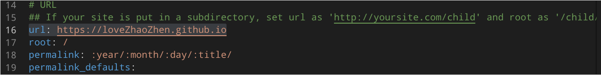

[Hexo官网](https://hexo.io/)
## 搭建框架
- 进入准备放置博客文件的文件夹
- $ npm install hexo-cli -g
- $ hexo init blog
- $ cd blog
- $ npm install
- $ hexo server
<!-- more-->
## 写作
`$ hexo new [layout] <title>`
可以在命令中指定文章的布局（layout），默认为 post，可以通过修改 _config.yml 中的 default_layout 参数来指定默认布局。
**layout(布局）**
Hexo 有三种默认布局：post、page 和 draft，它们分别对应不同的路径，而自定义的其他布局和 post 相同，都将储存到 source/_posts 文件夹。
```
布局	路径
post	source/_posts
page	source
draft	source/_drafts
```
#### 显示文章摘要信息
在文章中加入一个 `<!-- more-->`
#### 创建*categories*与*tags*
* 在blog根目录
`hexo new page categories`
`hexo new page tags`
* 打开*source/categories/index.md*
添加 `type: "categories"
* 打开*source/tags/index.md*
添加 `type: "tags"
* 给模板添加*categories*与*tags*
打开*scarffolds/post.md*
    - 添加*categories:*
    - 添加*tags:*  
如下
```
---
title: {{ title }}
date: {{ date }}
categories:
tags:
---
```
* 使用时只在新的文章创建后在文件首部填上该文章categories与tags即可
* 一般不需要再修改
*source/categories/index.md*
*source/tags/index.md*
(文章里填入的categories与tags会自动生成在该页面上)

**Tips**:添加tags有必须严格按照如下两种格式
  1. 把tags放在中括号`[]`里
  2. 用短划线`-`列出来
如
```
---
title: 博客配置
date: 2019-03-21 13:47:44
categories: 
- 博客搭建      (Hexo不支持指定多个同级分类)
- 主题配置     （此时 "主题配置"为"博客搭建"的子分类)
tags: [blog, 配置, 学习,其他]
---
```
```
---
title: linuxCommands
date: 2019-03-20 22:39:32
categories: linux系统
tags: 
- linux
- commands
---
```


## 完成后部署
`npm install hexo-server --save`
安装完成后，输入以下命令以启动服务器，您的网站会在 http://localhost:4000 下启动。在服务器启动期间，Hexo 会监视文件变动并自动更新，您无须重启服务器。

启动服务器
`$ hexo server`

可执行下列的其中一个命令，让 Hexo 在生成完毕后自动部署网站，两个命令的作用是相同的。
```
$ hexo generate --deploy
$ hexo deploy --generate
上面两个命令可以简写为
$ hexo g -d
$ hexo d -g
```
## 部署
- ### 将博客部署到Github

1. 在github上新建 repository 名字必须是 `username.github.io` 如 `loveZhaoZhen.github.io`
2. githubSHH配置
[githubSSH官方文档](https://help.github.com/en/articles/connecting-to-github-with-ssh)
    - 安装git
        `sudo pacman -S git`
    - 需要设置好姓名和邮箱之后才能开始使用 Git
        ```
        $ git config --global user.name  "Zhao Zhen"
        $ git config --global user.email "lovezhaozhen@gmail.com"
        ```
        查看git设置 `git config --list`
    - 安装openssh
        `sudo pacman -S openssh`
    - 生成SSH秘钥
        `ssh-keygen -t rsa -b 4096 -C "lovezhaozhen@gmail.com"`
    - 打开 ～.ssh/id_rsa.pub 复制全部内容
      粘贴在github上 settings -> SSH and GPG keys ->New SSH key 
    - 测试SSH设置是否成功  
    `$ ssh -T git@GitHub.com`
    output如下即可算是正常
    `Hi <<username>>! You've successfully authenticated, but GitHub does not provide shell access.`

    - 配置 _config.yml 
        - 修改url
            url: https://loveZhaoZhen.github.io
            
        - 修改deploy
            
            type: git
            repo:          git@github.com:loveZhaoZhen/loveZhaoZhen.github.io.git
            branch: master
    - 安装deployer插件
        `$ npm install hexo-deployer-git --save`
    - 部署 
    `hexo g` `hexo d(hexo deploy)`    
    `(hexo g -d)`

### 标签/分类数量统计不准确？
因为 Hexo 有缓存的功能，因此有时候你会发现在 标签 和 分类 页面中的数量统计并不准确。 出现这个问题时，可以按照以下步骤重新生成站点的内容：

* 删除站点目录下的 db.json 文件
* 在站点目录下执行命令 hexo clean
* 在站点目录下执行命令，重新生成 hexo generate
* 当执行完以上步骤后，可以在本地启动服务器来验证下是否已经解决问题。


### 文章资源文件夹
对于那些想要更有规律地提供图片和其他资源以及想要将他们的资源分布在各个文章上的人来说，Hexo也提供了更组织化的方式来管理资源。这个稍微有些复杂但是管理资源非常方便的功能可以通过将 config.yml 文件中的 post_asset_folder 选项设为 true 来打开。
```
_config.yml
post_asset_folder: true
```
当资源文件管理功能打开后，Hexo将会在你每一次通过 `hexo new [layout] <title> `命令创建新文章时自动创建一个文件夹。这个资源文件夹将会有与这个 markdown 文件一样的名字。将所有与你的文章有关的资源放在这个关联文件夹中之后，你可以通过相对路径来引用它们，这样你就得到了一个更简单而且方便得多的工作流。
Tips:如果用gitpage，切将图片文件放在与 markdown文件同名的文件夹下，则文章中的图片路径不需要写文件夹
如
```
在Blog.md中编辑文章，需要用到同名的Blog文件夹下的URL.png图片,则Blog.md中填写的路径应如下:

而不是
```